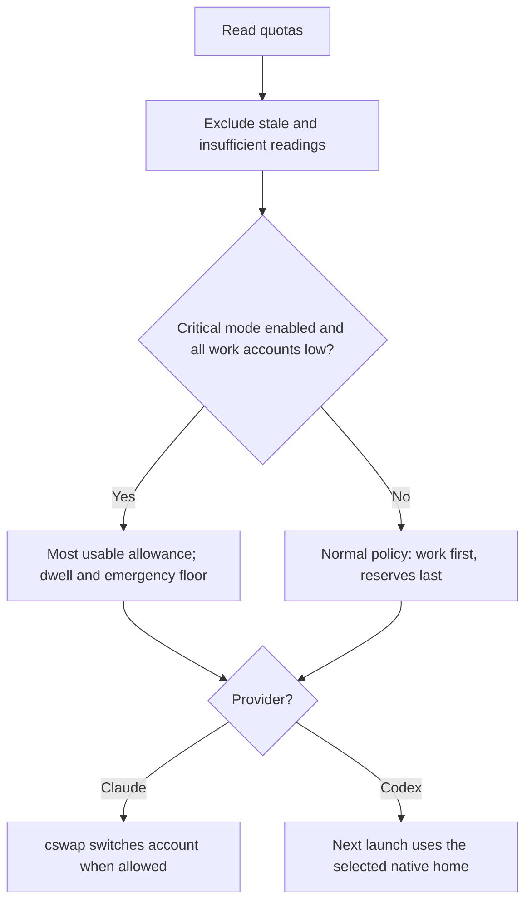

# HotPl8

**Spend less time juggling AI subscriptions.**

- **Pick the best available account.** Automatically switch Claude accounts using quota, reset times, and your reserve rules. Codex selects an account for your next launch.
- **Warm idle Claude accounts.** Optional small requests aim to start usage windows earlier, so accounts are ready when you need them.
- **See your subscriptions at a glance.** One layered bar for Claude and one for Codex: usable allowance now, projected refill, and full capacity. Individual accounts remain below.

[How the provider bars work](docs/provider-overview.md) · Scroll down for individual quotas, resets and selection details.

Windows preview. Starts in monitoring mode; Claude switching and warming are opt-in and experimental. Warming consumes quota and does not increase subscription limits. Codex warming remains unavailable pending native qualification. [Compatibility and provider boundaries](docs/compatibility.md).

## How it chooses

HotPl8 decides; **cswap carries out Claude switches**, and **native Codex launches in the selected home**. Warming is a separate, guarded action. [Ranking, warming, and credential flow](docs/architecture.md).

## Get started

**[Download the Windows preview](https://github.com/Mmore35/hotpl8/releases/tag/v0.1.0-rc.1)** and follow its [installation guide](https://github.com/Mmore35/hotpl8/blob/v0.1.0-rc.1/docs/install.md). One account is enough. Native tools and subscriptions are installed separately; HotPl8 needs no admin rights or hosted service.

Working from this source? See the [current setup guide](docs/install.md), including guided `hotpl8 setup -Interactive`. [All commands](docs/usage.md) · [Automation settings](docs/configuration.md) · [Troubleshooting](docs/troubleshooting.md).

Current source also includes [decision explanations, pause/work hours, weekly pace and an optional Windows tray](docs/operations.md). Mac implementation has a [ready-to-run handoff](docs/plans/macos-handoff.md).

See [layered capacity, refill countdowns and critical mode](docs/capacity.md). For a little color, run `hotpl8 nyan`.

Claude plan names are detected automatically on refresh. When window-capacity conversions are unavailable, the dashboard shows measured weekly headroom with a clear label.

## Under the hood

PowerShell, local snapshots, and offline regression tests. [Architecture and source map](docs/architecture.md) · [Contributing](CONTRIBUTING.md) · [Regenerate the screenshots](docs/screenshots.md).

[Report a bug](https://github.com/Mmore35/hotpl8/issues) · [Privacy](PRIVACY.md) · [Report a vulnerability](SECURITY.md) · [MIT license](LICENSE)

Independent project; not affiliated with Anthropic or OpenAI. [Third-party notices](THIRD_PARTY_NOTICES.md).

## Agent integration

Use `hotpl8 agent` for a versioned JSON request, or `hotpl8 mcp` for local MCP read tools. Optional cooperative pause leases let jobs pause automation independently. See the [agent API guide](docs/agent-api.md) for contracts, configuration and examples. Existing CLI output formats are preserved.

## T3 Code integration

The optional [Codex account routing for T3](docs/t3-integration.md) routes new
turns and auxiliary commands through enrolled subscriptions while keeping T3
conversation state in its existing home. First-time setup runs with T3 closed and
reuses its normal Codex provider; removal restores the original configuration.
Managed updates preserve active sessions and select the current release for new
processes. Existing two-provider installations need a separate conversation
migration to consolidate their picker. Windows and Node 22+ are required; native
long-running refresh and multi-account promotion gates remain documented.
