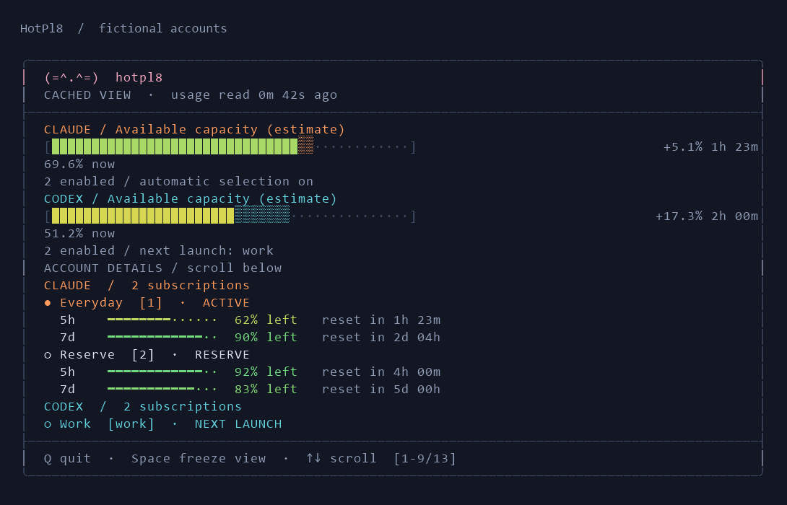
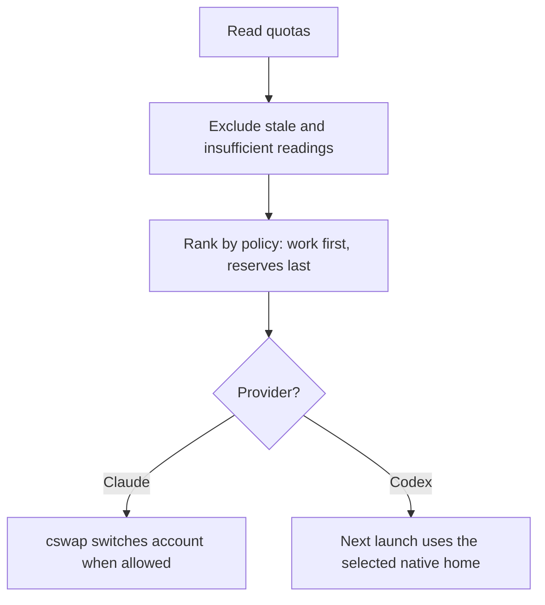

# HotPl8

**Spend less time juggling AI subscriptions.**

- **Pick the best available account.** Automatically switch Claude accounts using quota, reset times, and your reserve rules. Codex selects an account for your next launch.
- **Warm idle Claude accounts.** Optional small requests aim to start usage windows earlier, so accounts are ready when you need them.
- **See every account at a glance.** Remaining quota, reset times, active accounts, and stale readings in one terminal dashboard.

Windows preview. Starts in monitoring mode; Claude switching and warming are opt-in and experimental. Warming consumes quota and does not increase subscription limits. Codex warming remains unavailable pending native qualification. [Compatibility and provider boundaries](docs/compatibility.md).

## How it chooses

HotPl8 decides; **cswap carries out Claude switches**, and **native Codex launches in the selected home**. Warming is a separate, guarded action. [Ranking, warming, and credential flow](docs/architecture.md).

## Get started

**[Download the Windows preview](https://github.com/Mmore35/hotpl8/releases/tag/v0.1.0-rc.1)** and follow its [installation guide](https://github.com/Mmore35/hotpl8/blob/v0.1.0-rc.1/docs/install.md). One account is enough. Native tools and subscriptions are installed separately; HotPl8 needs no admin rights or hosted service.

Working from this source? See the [current setup guide](docs/install.md), including guided `hotpl8 setup -Interactive`. [All commands](docs/usage.md) · [Automation settings](docs/configuration.md) · [Troubleshooting](docs/troubleshooting.md).

Current source also includes [decision explanations, pause/work hours, weekly pace and an optional Windows tray](docs/operations.md). Mac implementation has a [ready-to-run handoff](docs/plans/macos-handoff.md).

## Under the hood

PowerShell, local snapshots, and offline regression tests. [Architecture and source map](docs/architecture.md) · [Contributing](CONTRIBUTING.md) · [Regenerate the screenshots](docs/screenshots.md).

[Report a bug](https://github.com/Mmore35/hotpl8/issues) · [Privacy](PRIVACY.md) · [Report a vulnerability](SECURITY.md) · [MIT license](LICENSE)

Independent project; not affiliated with Anthropic or OpenAI. [Third-party notices](THIRD_PARTY_NOTICES.md).
