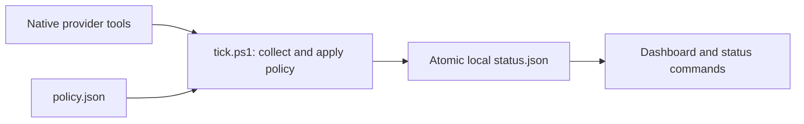
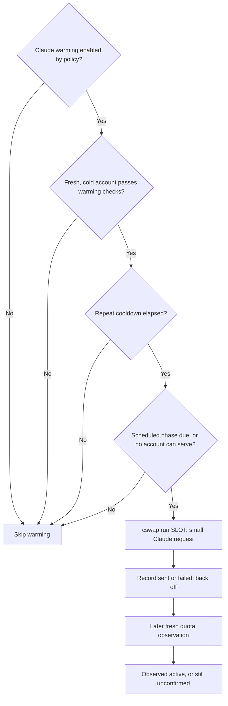

# How HotPl8 works

HotPl8 collects quota readings, chooses accounts according to policy, and renders a cached terminal dashboard. Displaying the dashboard never launches a provider process. There is no HotPl8 server.



## Who decides, and whose login is used?

HotPl8 owns the decision policy. For Claude, it reads `cswap list --json` and uses numeric account slots. When a switch is allowed, it calls `cswap switch SLOT`; cswap owns the switch mechanism and the corresponding account credentials. HotPl8 changes its reported active account only when that command succeeds. It does not claim to rebind an already running client.

Codex has separate native homes. Each slot points to an explicitly enrolled, independently signed-in home. HotPl8 launches a child Codex process with that home's `CODEX_HOME`; it does not rewrite the parent environment or move credentials between homes. **NEXT LAUNCH** is a recommendation, not a claim that an existing session switched. An explicit slot launch validates native authentication but does not guarantee quota. Resume requires the slot that owns the conversation.

There is no separate Warden component in this repository: collection and decisions live in `tick.ps1` and the provider adapters.

## Account selection

1. Exclude unavailable, stale, malformed, or insufficient quota readings from automatic selection. Missing quota is unknown, not unlimited.
2. Keep reserve accounts behind work accounts. Healthy accounts outrank accounts near their weekly floor; among degraded accounts, favor more weekly headroom.
3. Among healthy peers, use configured preference order or the soonest reset. Unmeasurable reset times sort behind known expiry times.
4. Avoid needless changes. Claude uses a headroom band in preference mode or a reset lead in soonest-reset mode; a hold blocks the switch. Codex applies its own recommendation rules before launch.

Claude: [Test-Ok, Get-RankedOrder, Invoke-ClaudeTick](../src/providers/claude.ps1). Codex: [Get-CodexEligibility, Select-CodexSlot, Get-CodexLaunchPlan](../src/providers/codex.ps1). These choose according to configured policy; “best” is not a universal optimization guarantee.

## Warming is a separate decision

Warming aims to start a cold Claude usage window earlier with a small request. It consumes quota; it cannot increase a subscription's limits or promise a useful window. No Codex warming exists.



At most one cold account is attempted per tick. The `maintain` pattern has no phase delay. A switch hold does not disable warming or recovery probes; monitor mode disables all automatic actions. Explicit `refresh` also disables actions regardless of policy. See [Get-Hotpl8Actions](../src/config.ps1), [Invoke-SlotPing and Invoke-ClaudeTick](../src/providers/claude.ps1), and [configuration](configuration.md).

The experimental Claude adapter includes legacy credential cleanup around `cswap run`. That boundary is unresolved; see [compatibility](compatibility.md#provider-boundaries) and [privacy](../PRIVACY.md) before enabling automation. The diagram describes implemented control flow, not provider approval.

## Three decisions worth understanding

| Decision | Why | Evidence |
|---|---|---|
| Display only cached snapshots | Opening or resizing the UI must not spend quota or change accounts | [Dashboard](../src/dashboard.ps1); [pipe and unchanged-cache test](../tests/test-dashboard.ps1) |
| Lock collection and replace status atomically | Readers should not see a partially written snapshot; failed collection must not look fresh | [Collector](../tick.ps1), [atomic writes](../src/common.ps1); [collection/lock regressions](../tests/test-codex.ps1) |
| Keep native account homes separate | A launch or resume must not accidentally use another account's authentication or conversation | [Codex adapter](../src/providers/codex.ps1); [home binding and resume tests](../tests/test-codex.ps1) |

For example, an elapsed reset does not prove that quota refilled. The dashboard says it awaits observation, and stale accounts lose their NEXT LAUNCH badge. [Regression coverage](../tests/test-dashboard.ps1) exercises both cases with a controlled clock.

## Source map

```text
hotpl8.cmd / hotpl8.ps1       User commands
tick.ps1                    Collection and action orchestration
setup-codex.ps1             Native account enrollment and optional hooks
install/uninstall/rollback.ps1
                            Stable installation entrypoints
src/
  common.ps1                Atomic files, quoting, bounded processes
  config.ps1                State resolution and policy validation
  diagnostics.ps1           Offline doctor and bounded event logs
  dashboard.ps1             Read-only terminal renderer and palette
  lifecycle.ps1             Install ownership, manifests, scheduler
  automation.ps1            Shared pause, schedule and attempt gates
  warming.ps1               Receipt persistence and observation reconciliation
  collection.ps1            Persisted collection due times and backoff
  forecast.ps1 / insights.ps1
                            Shared estimates, bounded history and activity
  selection.ps1 / replay.ps1 Optional ranking keys and production-selector replay
  management.ps1            Validated account operations and setup
  updates.ps1               Release identity and provenance verification
  notifications.ps1 / tray.ps1
                            Optional cache consumer and transition alerts
  providers/                Claude and Codex adapters
tests/                      Offline regression suites
  fixtures/                 Fictional documentation data
scripts/                    Checks, tests, packaging, screenshots
docs/                       Guides and generated screenshots
examples/                   Provider policy examples
```

Public entrypoints stay at the root so existing commands, scheduled tasks, and hooks keep their paths. Internal code lives under src/; source and tests ship through an explicit release manifest. Writable state remains outside the installed app directory.

## Tradeoffs and limits

PowerShell keeps the Windows installation small, but other platforms are not release-qualified. Native provider contracts can change: fixture tests establish local behavior, while live compatibility needs separate evidence. Monitor mode is the starting point; optional automation needs explicit configuration. See [compatibility](compatibility.md) for the tested scope and remaining qualification work.

The collector adds insights and shadow decisions before one atomic publication. Views consume recorded decisions and overlay the latest collector/pause state; they never run selection actions. [Operations and state contracts](operations.md).
