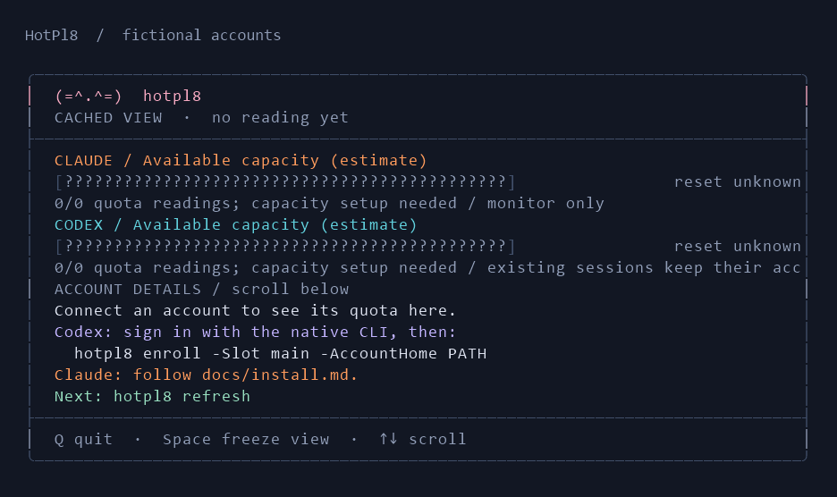

# Install on Windows

This is a release candidate. Use Windows PowerShell 5.1 and a terminal such as Windows Terminal. Mac/Linux source use is experimental. Installation is per-user and requires no administrator rights.

1. Install and sign into the native tools for the providers you want. Follow [Codex installation](https://developers.openai.com/codex/cli/) or [Claude Code setup](https://code.claude.com/docs/en/setup). Claude monitoring also requires Python 3.12+ and a compatible [claude-swap](https://github.com/realiti4/claude-swap) installation; its upstream isolated installation instructions are preferred. Codex-only use requires neither Python nor claude-swap.
2. Download/extract a reviewed HotPl8 archive. Compare `Get-FileHash .\hotpl8-VERSION-windows.zip -Algorithm SHA256` with the release's SHA256SUMS through a trusted release page. Checksums detect mismatch; they do not independently prove publisher identity. Do not weaken global execution policy. Inspect/unblock only the downloaded files you trust if Windows marks them as downloaded.
3. In the extracted directory run `powershell -NoProfile -ExecutionPolicy Bypass -File .\install.ps1`. Default installation: `%LOCALAPPDATA%\HotPl8`; writable state: its `state` subdirectory. Code lives separately in `app`. Use `-InstallDirectory` and `-StateDirectory` for custom locations. `-NoPath` avoids changing user PATH.
4. Open a new terminal. `hotpl8 doctor` reports missing dependencies without logging in or collecting quota.

## Enroll Codex

Sign into the desired native Codex home first. Open a new terminal after installation, then run:

```powershell
hotpl8 enroll -Slot main -AccountHome "$env:USERPROFILE\.codex"
hotpl8 refresh
hotpl8
# When you want to launch Codex in this account:
hotpl8 codex -Slot main
```

The `enroll` shortcut is in the current source; the v0.1.0-rc.1 ZIP uses [its versioned enrollment instructions](https://github.com/Mmore35/hotpl8/blob/v0.1.0-rc.1/docs/install.md#enroll-codex).

Enrollment runs a quota read to validate native subscription authentication. Do not copy auth.json between homes. Additional independently signed-in homes can be enrolled explicitly. Automatic model routing requires a verified `codex.modelMeters` mapping. A second account is not required for monitoring or explicit-slot launching.

Hooks are optional: `setup-codex.ps1` supports `-InstallHook`, then native Codex requires reviewing/trusting the handler in `/hooks`. Unrelated handlers are preserved. The general installer already supplies the command; do not use legacy `-InstallCommand` for an installed app.

## Enroll Claude

Use native Claude login and `cswap add` as documented upstream. Put the chosen numeric slot IDs into state/policy.json's `prefer` array and add non-sensitive display labels. Keep `mode: monitor` while verifying readings. The [configuration guide](configuration.md) explains reserves and experimental automation. HotPl8 does not provide a third-party sign-in flow.

## Background collection

Rerun the installer from the extracted release with `-Schedule`. It registers one hidden, unelevated task that wakes every minute for the signed-in user; persisted due times normally collect every five minutes and can shorten in critical mode. Repeated installation updates the owned task. It does not run while the user is signed out. Monitoring policy remains observation-only.

A source checkout is also portable: run `powershell -NoProfile -ExecutionPolicy Bypass -File .\hotpl8.ps1 init`, enroll accounts, then use the same command with `refresh` in place of `init`. Source checkout state defaults to that directory. An explicit `-StateDirectory` overrides `HOTPL8_STATE_DIRECTORY`, which overrides the installed binding or portable default.

## First screen



After enrollment, `hotpl8 refresh` collects readings. Opening `hotpl8` only displays the cache. If an account needs sign-in, use its native login flow and refresh again. `hotpl8 doctor` gives offline next steps.

## Guided setup in the 0.2 source candidate

Run `hotpl8 setup -Interactive` after installation for native account enrollment without editing JSON. `hotpl8 setup` prints equivalent noninteractive commands. Existing native sign-in is required; setup does not enable automatic actions. [Account controls and readiness](operations.md). macOS implementation continues from the [Mac handoff](plans/macos-handoff.md).
