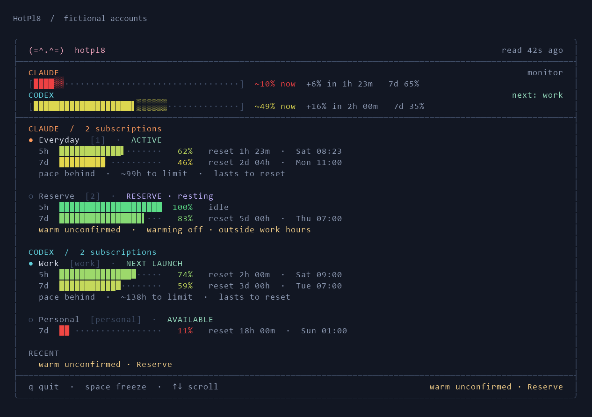

# Account operations



These commands are in the 0.2 source candidate. The older downloadable preview does not contain them. Start with `hotpl8 setup`, optionally `hotpl8 setup -Interactive`. Setup preserves existing policy and uses native sign-in; it does not enable automation. Claude enrollment uses an existing cswap account number:

```powershell
hotpl8 enroll -Provider claude -Slot 1 -Label Everyday
hotpl8 enroll -Slot main -AccountHome C:\Accounts\main -Label Work
hotpl8 refresh
hotpl8 explain
```

Native account directories must already be independently signed in. Codex enrollment checks existing homes for duplicate subscriptions before saving. Failed verification or cancellation preserves existing policy. `hotpl8 capabilities -AsJson` distinguishes installed tools, enrolled accounts, fresh quota evidence and experimental capabilities. It is an offline report; an installed CLI is not proof of authentication.

## Account controls and pause

```powershell
hotpl8 accounts
hotpl8 accounts -Provider claude -Slot 1 -Operation rename -Label Everyday
hotpl8 accounts -Slot main -Operation reserve
hotpl8 accounts -Slot main -Operation work
hotpl8 accounts -Slot main -Operation disable
hotpl8 accounts -Slot main -Operation enable
hotpl8 pause -Minutes 120
hotpl8 resume
```

Disabled accounts cannot be selected; explicit Codex launch also rejects them. Disabled Codex homes are not polled. Claude inventory is one upstream call, but disabled slots cannot authorize switches, warming or probes. Reserve status changes priority and weekly floors; it does not disable the account. Changes validate the complete policy, reject concurrent edits, save `policy.previous.json`, and atomically replace policy. Cached decisions update on the next collection; native launch rechecks policy immediately.

Pause persists across restarts and suppresses automatic switching, warming and recovery probes. Quota collection and deliberate Codex launches continue. Dashboard Space only freezes the view. Existing hold leases suppress switches separately; they do not mean warming is paused.

## Work hours and bounded attempts

Policy version 2 adds:

```json
{
  "automation": {
    "schedule": { "days": [1, 2, 3, 4, 5], "start": "09:00", "end": "18:00" },
    "dailyAttemptLimit": 12,
    "warmExcluded": ["claude:2", "codex:personal"]
  },
  "historyEnabled": false,
  "notificationsEnabled": false,
  "claudeModels": []
}
```

This is a fragment to merge into a complete policy with `schemaVersion: 2` and an explicit mode. Existing version-1 policies remain supported. New installations remain monitor-only, with history and notifications off. Account commands upgrade the policy without enabling actions. Older releases reject version 2; rollback checks reader compatibility before replacing files.

Days use Sunday=0 through Saturday=6. Start is inclusive, end exclusive. Overnight intervals belong to their starting day; equal start/end allows no prompts. Omit the schedule for all hours. The default time zone is local; optional `timeZone` uses an ID supported by the host PowerShell runtime. Check that ID again when moving policy between Windows and Mac. Local daylight-saving transitions follow the runtime time-zone database.

The daily limit counts actual dispatch attempts per provider and slot on the UTC date, including failures and recovery probes. The default is 12; allowed range is 1–100. It complements existing cooldowns and phase rules. Work hours and exclusions limit prompts, while switching has its own policy and pause controls. Monitoring never spends an attempt budget.

## Warming and collection evidence

The warm receipt records `requested` before dispatch, `sent` after process success, or `failed`. A later fresh observation of the same account and a plausible five-hour reset can promote it to `observed-active`. That describes the observed window, not proof that the warm request caused it. No observed transition after 15 minutes becomes `unconfirmed`; there is no timer-based assumed success. Pending receipts suppress duplicate requests through their bounded five-hour expiry, including across crashes. A changed account invalidates the receipt. Verification uses normal collection; it sends no extra prompt.

Collector state records start, completion, due times and failures. The dashboard and tray read it separately from the last completed snapshot, so a stalled collector stays visible. Scheduled polls share a single collector lock and persisted due times. Failure backoff grows from five to thirty minutes; manual refresh does not bypass it. A healthy manual refresh can collect immediately. One unavailable provider does not prevent the other from publishing. Cached quota keeps its original observation time and never becomes fresh just because a new snapshot was written.

`hotpl8 explain` shows the actual recorded selection reasons and warns when old. `status -AsJson` includes per-account evidence, collector state, bounded recent actions and read-only `shadow` decisions. Snapshots are private local data, not a redacted support export; use `doctor -AsJson` for that.

## Pace, model constraints and alternative ordering

Weekly pace compares usage with elapsed time in an observed seven-day window. The cycle-average time-to-limit is an estimate, not a promised amount of remaining work. Zero usage, an expired/unconfirmed reset, stale readings, or less than a day of weekly evidence produce no forecast. With `historyEnabled: true`, separated samples from the same window can also provide a recent-rate estimate. History stays local, with at most 4,096 samples over 14 days and one sample per stream per 30 minutes. `hotpl8 history` reports retention; `hotpl8 history -Operation clear` deletes those samples. Disable history to stop future recording. The pre-existing bounded Codex observation audit log is separate.

Set `claudeModels` to exact scoped quota names reported by your installed cswap contract. Every requested scope must be present, have a future reset, and meet the slot's weekly floor. Missing or exhausted scoped quotas block eligibility; unrelated headroom cannot substitute for them. Scopes remain visible without configuration but do not silently choose your intended model. Codex continues to require explicit verified `modelMeters` mappings.

The default remains `soonest-reset`. Two opt-in `order` values work within the existing work/reserve and degraded-quota tiers:

| Order | Objective |
|---|---|
| `weekly-expiry` | Prefer the earliest trusted weekly reset. Unknown anchors sort last. |
| `balanced` | Prefer weekly allowance per remaining five-hour interval, capped by current short-window headroom. |

They are experimental strategies, with no claim of measured savings. Each collection records shadow choices using production selectors. For multi-snapshot comparison, save an array of status snapshots outside the repo and run:

```powershell
powershell -NoProfile -ExecutionPolicy Bypass -File .\scripts\replay.ps1 -Trace C:\Private\trace.json -PolicyPath C:\Private\policy.json
```

Use the policy that produced the trace, apart from the ordering being compared. Replay preserves freshness, scoped blocks, reserves, holds and hysteresis. It reports selections, switch counts, unavailable decisions and reserve selections. It cannot infer counterfactual quota savings: changing accounts changes subsequent usage. Keep the baseline until prospective native testing supports another choice.

## Optional Windows tray

Run `hotpl8 tray` in a Windows desktop session. It reads the same cache, shows account details, opens the terminal dashboard, and exposes deliberate pause/resume commands. It owns no provider process or collector. Quit removes the icon; scheduled collection continues. A per-state mutex prevents two tray consumers from duplicating notifications. `hotpl8 tray -Once` prints the view model without opening a window.

Notifications require `notificationsEnabled: true` and follow work hours. They cover sustained collector failure, no eligible account, native sign-in needs and a fresh depletion estimate. Transition state persists across restarts and ignores harmless reset drift. Routine polls and warm successes do not notify. Windows may suppress balloons under system notification settings. This companion is optional, is not installed at startup, and has not yet completed an interactive desktop/idle-resource qualification pass. Native Mac delivery belongs to the [Mac handoff](plans/macos-handoff.md).

The dashboard, status command and tray share the [provider overview](provider-overview.md). `status -AsJson` adds `providerOverview` while retaining all per-account fields; `explain -AsJson` also includes it. `remainingPercent` is null with partial coverage; `knownRemainingPercent` and `unknownPercent` use the full enabled membership as their denominator. `computedAt` is the calculation clock, not a quota observation timestamp.

## Critical-budget operation

[Critical mode](capacity.md) is opt-in, uses per-window floors and hysteresis, and persists decisions across collector restarts. Successful collection uses a shorter due time while critical; failed observations retain their retry deadline through skipped wakes. No automatic replay of a failed prompt or migration of an existing Codex session is performed.
