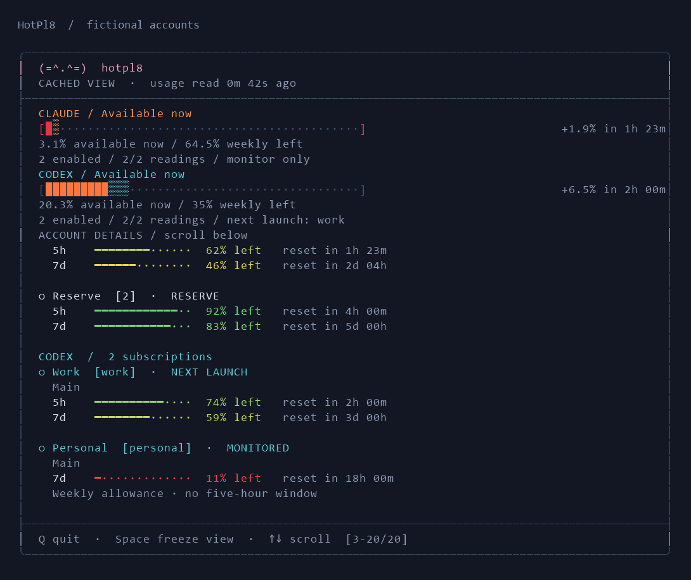
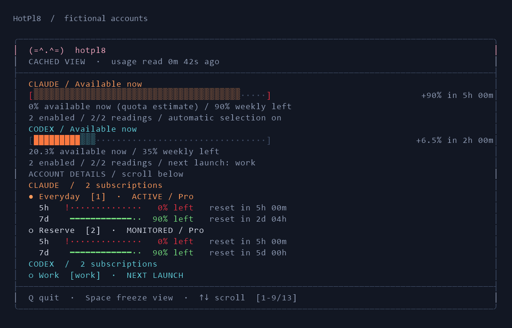

# Provider overview

The pinned overview shows **Available now** for Claude and main Codex. Solid fill represents estimated usable allowance under current limits and routing policy. Weekly remaining is supporting text beneath the bar. Spark is excluded from the summary, dashboard details and tray; native data remains available in JSON.

Configured window conversions produce a capacity estimate. Without them, recognized plans produce a **quota estimate**: take each account's smallest remaining percentage across short, weekly and configured model limits, apply routing/selection restrictions, then average using published plan session multipliers. This dimensionless headroom estimate is not an exact token budget or an inferred conversion between weekly and five-hour capacity. Unknown multi-account plan weights remain unknown. For example, accounts with 90% weekly remaining but exhausted short windows contribute zero now.

The patterned extension appears only for the **first positive refill within the next 24 hours**, including exactly 24 hours. A reset that adds nothing is skipped. Its countdown appears on the right; no later refill is hatched. Missing readings are reported as `Partial: 2/3 measured; total unavailable`, never as a patterned region. Partial fill includes only the measured share of the full account set; it is not the total remaining balance. Projections assume no further consumption and unchanged policy. The clock reaching a reset never refills the solid bar without a fresh observation. [Capacity, critical mode and motion](capacity.md).

The dashboard, CLI and tray consume the same `providerOverview.PROVIDER.immediate` JSON computation. Its `metric` identifies calibrated capacity versus estimated quota headroom. The original `capacity` and normalized weekly-headroom fields remain for compatibility. Codex's unconfirmed reset anchors restrict projections, not otherwise valid current quota percentages. Automatic Codex warming remains unavailable; weekly-only accounts report warming as not applicable.

