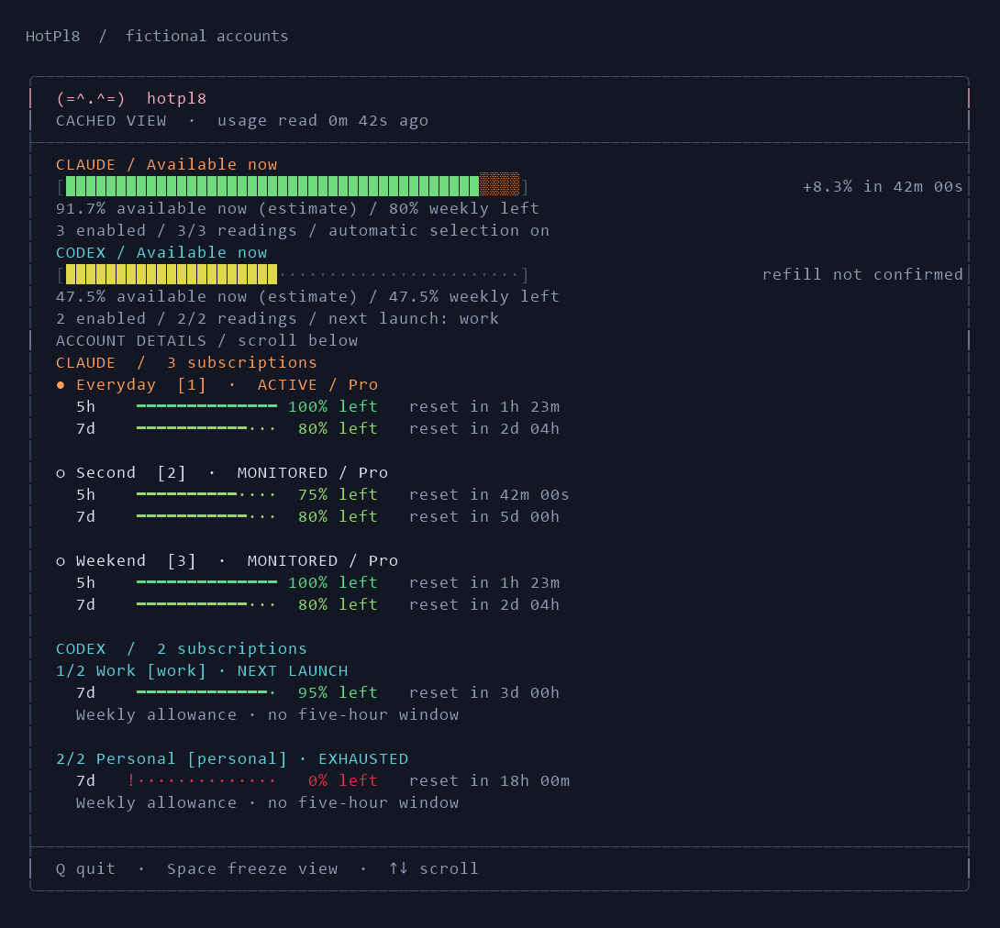

# Provider overview

The pinned overview shows **Available now** for Claude and main Codex. Solid fill represents estimated usable allowance under current limits and routing policy. Weekly remaining is supporting text beneath the bar. Spark is excluded from the summary, dashboard details and tray; native data remains available in JSON.

For three equal plans with five-hour balances of **100%, 100%, and 75%**, the bar shows **91.7%**, reaching **100%** when the 75% account resets. A full session is the denominator; a weekly-only account uses its actual weekly window. Published session multipliers or calibrated capacities weight different plans.

Weekly/model limits reduce that amount when a reliable window conversion exists. Otherwise they enforce exhaustion and policy gates without treating weekly and session percentages as interchangeable. A low weekly balance with no conversion is labeled **weekly cap uncertain**; actual capacity may be lower. Unknown multi-account plan weights remain unknown. Accounts with 90% weekly remaining but exhausted short windows contribute zero now.

The patterned extension appears only for the **first positive refill within the next 24 hours**, including exactly 24 hours. A reset that adds nothing is skipped. Its countdown appears on the right; no later refill is hatched. Missing readings are reported as `Partial: 2/3 measured; total unavailable`, never as a patterned region. Partial fill includes only the measured share of the full account set; it is not the total remaining balance. Projections assume no further consumption and unchanged policy. The clock reaching a reset never refills the solid bar without a fresh observation. [Capacity, critical mode and motion](capacity.md).

The dashboard, CLI and tray consume the same `providerOverview.PROVIDER.immediate` JSON computation. Each account exposes `confidence`, `weightBasis` and `unconvertedConstraints`. The original `capacity` and normalized weekly-headroom fields remain for compatibility. Codex's unconfirmed reset anchors restrict projections, not otherwise valid current quota percentages. Automatic Codex warming remains unavailable; weekly-only accounts report warming as not applicable.

Codex details number each subscription (`1/2`, `2/2`) and show its label, unique slot ID and one availability verdict, such as **EXHAUSTED** or **NEXT LAUNCH**. A successfully read but exhausted account is not labeled available. Scroll the account details to see subsequent entries; the provider summaries stay pinned.

