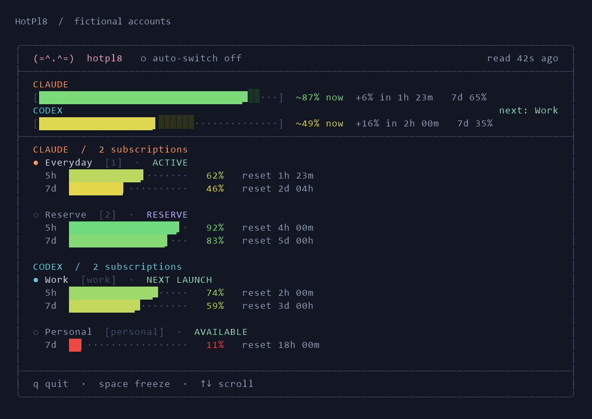
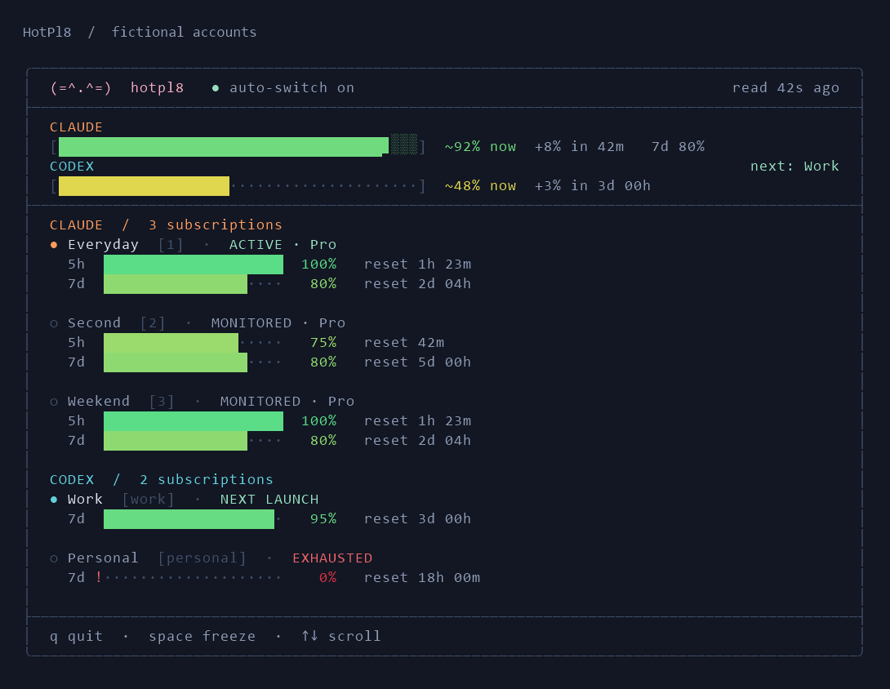
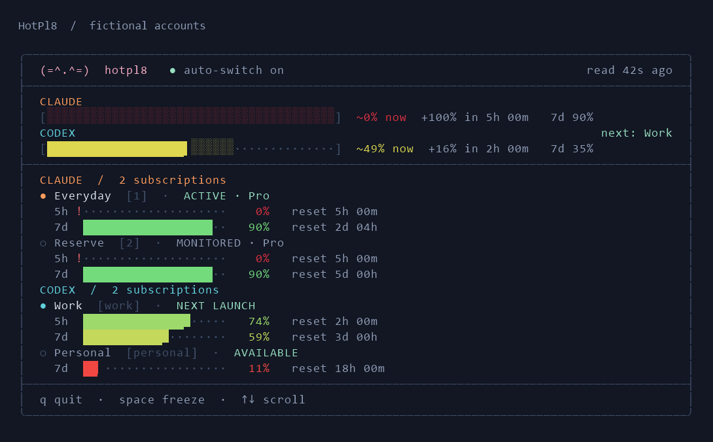

# Provider overview

The pinned overview shows **Available now** for Claude and main Codex. Solid fill represents estimated usable allowance across every account that can be read now. An account that cannot be read, or is blocked for an unstated reason, is left out of the bar and shown on its own row; the bar never blanks because of one account. Auto-switch being off or paused does not shrink the bar, because switching may be done by hand or by another tool; a selection hold still narrows it to the held account. Weekly remaining is supporting text beneath the bar. Spark is excluded from the summary, dashboard details and tray; native data remains available in JSON.

For three equal plans with five-hour balances of **100%, 100%, and 75%**, the bar shows **91.7%**, reaching **100%** when the 75% account resets. A full session is the denominator; a weekly-only account uses its actual weekly window. Published session multipliers or calibrated capacities weight different plans.

Weekly/model limits reduce that amount when a reliable window conversion exists. Otherwise they enforce exhaustion and policy gates without treating weekly and session percentages as interchangeable. A low weekly balance with no conversion is labeled **weekly cap uncertain**; actual capacity may be lower. When plan weights are unknown or not comparable, each readable account counts equally on its current window, and the figure is marked `~` as an estimate. The calibrated `capacity` model keeps such weights unknown. Accounts with 90% weekly remaining but exhausted short windows contribute zero now.

The patterned extension appears only for the **first positive refill within the next 24 hours**, including exactly 24 hours. A reset that adds nothing is skipped. Its countdown appears on the right; no later refill is hatched. A useful refill further out is named as text beside the bar, such as `+50% in 3d 14h`, so a provider with nothing arriving today still says when it does. The bar measures readable accounts only; `immediate.coverage` in JSON lists each account left out and why (`unreadable` or `blocked`). With no readable account the bar is empty. Projections assume no further consumption and unchanged policy. The clock reaching a reset never refills the solid bar without a fresh observation. [Capacity, critical mode and motion](capacity.md).

The dashboard, CLI and tray consume the same `providerOverview.PROVIDER.immediate` JSON computation. Each account exposes `confidence`, `weightBasis` (`equal` when no common plan basis exists) and `unconvertedConstraints`. The original `capacity` and normalized weekly-headroom fields remain for compatibility. Codex's unconfirmed reset anchors restrict projections, not otherwise valid current quota percentages. Automatic Codex warming remains unavailable; weekly-only accounts report warming as not applicable.

Codex details number each subscription (`1/2`, `2/2`) and show its label, unique slot ID and one availability verdict, such as **EXHAUSTED** or **NEXT LAUNCH**. A successfully read but exhausted account is not labeled available. When optional details would hide accounts, the dashboard condenses them if that lets every account fit. Larger windows retain the extra detail. In smaller windows, use the arrow keys or **End** to reach later accounts; the provider summaries stay pinned.

